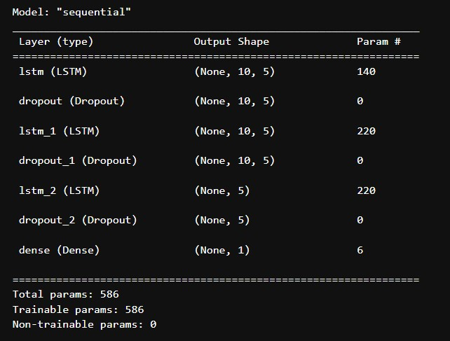
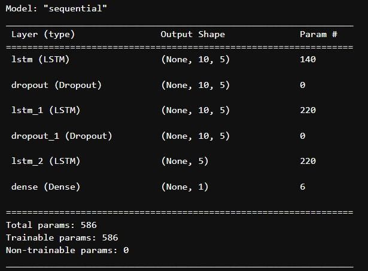
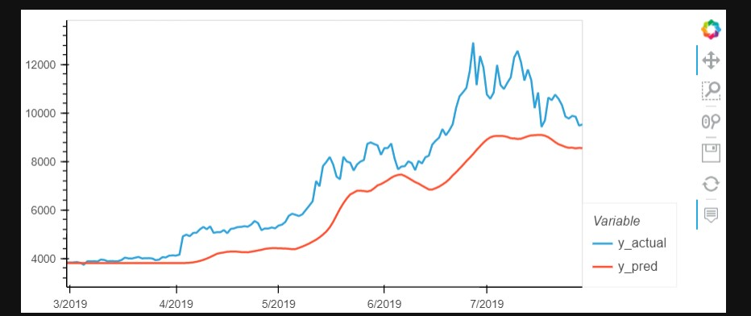
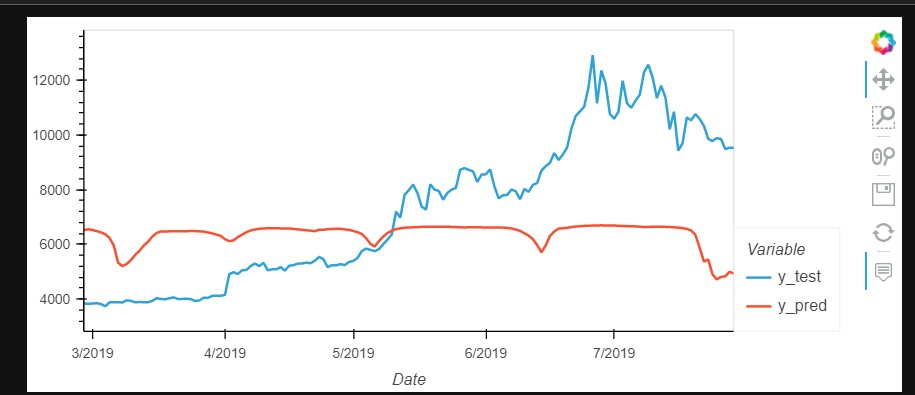

## Deep-Learning
1. In this project the models were to be setup to forecast prices of bitcoin by using past closing prices and sentiments as feature but seperately.
2. The standard procedure was followed which is enumerated below:  
   1. Importing necessary libraries and dependencies.
   2. Data processing which includes the following:
      1. Retrieving data.
      2. Deciding features and target.
      3. Scaling the data.
      4. Splitting it into train and test sets.
   3. Setting up the model, the summary for both models is as follows :
      1. Model summary for model that uses closing prices as feature :
         
      2. Model summary for model that uses sentiment score as feature :
         
   4. After setting up the model the next step is to train it with the hyperparameters that were set according to the instructions provided.
   5. The next step is to make predictions after evaluating the eventual loss output after the last epoch.
   6. Following are the comparitive results of the two models :
      1. #### Model with closing prices feature:
         
      2. #### Model with sentiment score feature:
         
